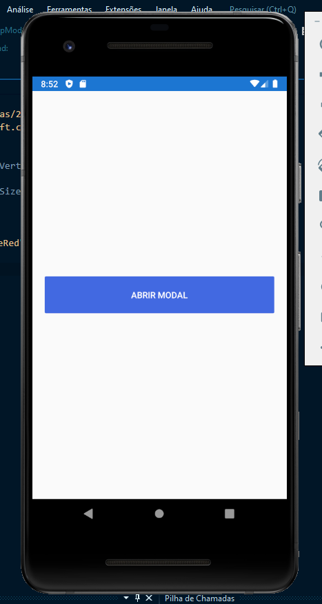
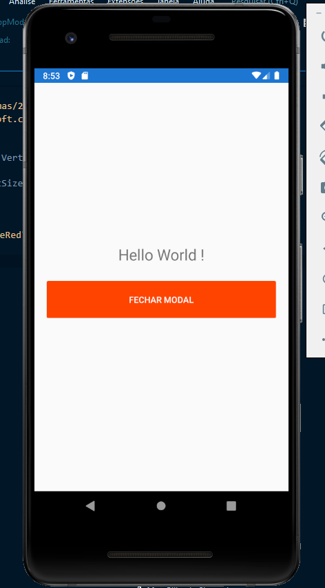

# AppModal 

### Aplicativo de demonstração modal feito em Xamarin Forms tecnologia .NET cross-plataform 

## `📱 IOS ANDROID UWP` .

# 

## Exemplo :

#
# Exemplo Fechar : 

### 🛠 Ferramentas 

[Visual Studio 2019](https://visualstudio.microsoft.com/pt-br/).

[Android 9.0](https://www.android.com/versions/pie-9-0/).
